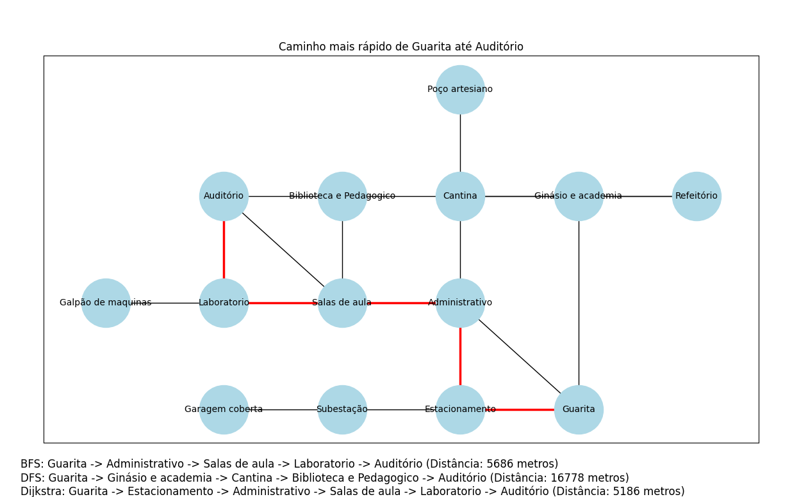

# Mapeamento de Caminhos no Campus IFC - Videira 
Alunos: Lucas Magalhães e Vitor Carlet

Este algoritimo foi desenvolvido para mapear os ambientes do campus do IFC Videira, estimar as distâncias entre os pontos, e utilizar algoritmos de busca para encontrar o caminho mais curto entre dois locais específicos. O projeto utiliza três algoritmos diferentes: **BFS (Busca em Largura)**, **DFS (Busca em Profundidade)** e **Dijkstra (Caminho mais curto com base em distâncias)**.

## Objetivo

O objetivo principal é criar um grafo que represente o campus, com todos os pontos relevantes (como auditório, laboratórios, salas de aula, biblioteca, etc.), suas conexões e distâncias entre eles. A partir disso, o sistema permite ao usuário selecionar um ponto de partida e um destino, apresentando o caminho mais curto utilizando três algoritmos diferentes. O usuário pode visualizar os caminhos encontrados e as distâncias em metros, tudo mostrado graficamente.

## Como Funciona

1. **Mapa e Grafo**: O campus foi mapeado e transformado em um grafo. Cada ponto do campus (como a biblioteca, laboratórios, auditório) é representado como um nó do grafo, e as conexões entre esses pontos (os caminhos) são as arestas do grafo. Cada aresta tem um peso, que corresponde à distância real entre os pontos, medida em metros.

2. **Algoritmos de Busca**:
   - **BFS (Busca em Largura)**: Este algoritmo busca o caminho mais curto em termos de número de arestas, mas não considera os pesos das arestas (distâncias).
   - **DFS (Busca em Profundidade)**: Este algoritmo explora ao máximo um caminho antes de voltar e tentar outras opções, mas não é otimizado para encontrar o caminho mais curto.
   - **Dijkstra**: Este algoritmo encontra o caminho mais curto baseado nos pesos das arestas, ou seja, na distância real entre os pontos.

3. **Visualização**: O grafo é desenhado, e o caminho mais curto encontrado pelo algoritmo de Dijkstra é destacado. Além disso, os resultados dos três algoritmos são exibidos abaixo do gráfico, com a lista de nós visitados e a distância total percorrida.

> **Nota**: A representação gráfica é apenas uma demonstração e não inclui todos os caminhos possíveis entre os pontos do campus. Por esse motivo, os resultados apresentados abaixo podem mostrar diferentes pontos percorridos que não estão necessariamente representados na visualização.

## Exemplo de Execução

Ao rodar o código, o usuário pode inserir dois pontos no campus, como "Guarita" e "Auditório". O sistema então calcula e apresenta os caminhos encontrados pelos três algoritmos. O caminho mais curto encontrado por Dijkstra é destacado no gráfico.

### Exemplo de saída:

 ## Como Executar                                                                 

 ### Pré-requisitos                                                               
                                                                                  
 - Python 3.x instalado                                                           
 - Bibliotecas Python necessárias:                                                
 - **NetworkX**: Para modelagem e visualização do grafo.                          
 - **Matplotlib**: Para a visualização gráfica do caminho.                        

  1. Clone o repositório do GitHub: git clone https://github.com/SeuUsuario/SeuRepositorio.git.
  2. Cd SeuRepositorio.
  3. Execute o arquivo python main.py.
  4. Digite o ponto de partida e
     o ponto de destino.
  6. Após inserir os pontos, o sistema exibirá um gráfico com o caminho mais curto e mostrará no terminal e abaixo da imagem os resultados dos três algoritmos, incluindo a distância em metros.

